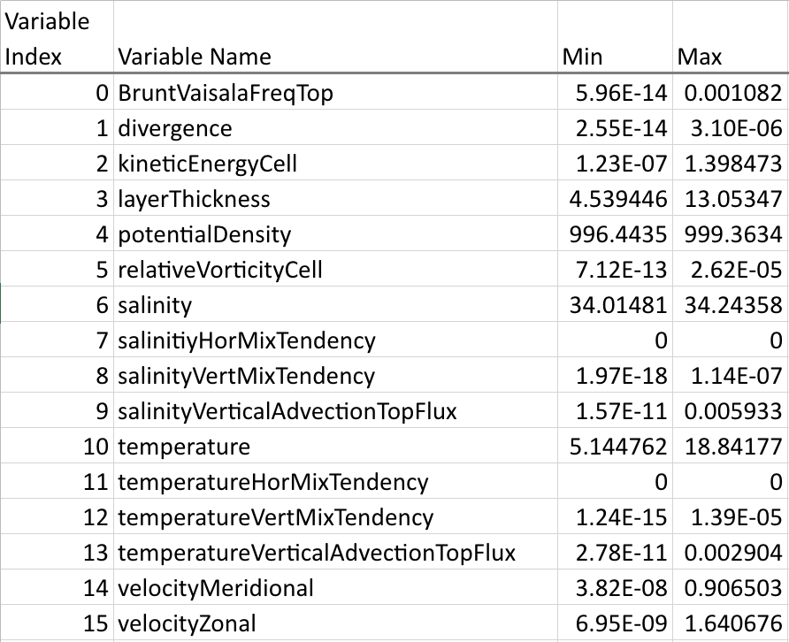

# Overview
We store the perturbed ensemble SOMA simulation data and the
postprocessed data (downscaled regular grid) in the project folder on
`Perlmutter`.

Data path: `/global/cfs/projectdirs/m4259/ecucuzzella/soma_ppe_data`

The folder contains raw simulation output from purturbing `GM, Redi, cvmix,
bottom_drag_coef` and data converted to regular grids.

## Raw simulation output
The folder contains raw simulation output from purturbing `GM, Redi, cvmix,
bottom_drag_coef` and data converted to regular grids. ## Raw Simlation Output
The raw simulation data live under `cvmix/, gm/, implicitbottomdrag/, redi/`.
There are 100 runs in each folder, containing the entire third year of data by
month. The time resolution is day.

Example: In
`/global/cfs/projectdirs/m4259/ecucuzzella/soma_ppe_data/redi/output_9`, the
data file `output.0003-06-01_00.00.00.nc` contains the simulation output for
the sixth month of the third year. 

The data files are in `netCDF` format. There are 60 vertical levels and >8000
hexagonal cells making up the horizontal plane at each level. Each cell is
associated with 73 variables (including the parameters). 

>Can follow up on the list of the variables.

## Postprocessed
The converted data for the current ML work is under
`ml_converted`. Currently the processed data only contain the results of one
month and are stored in `hdf5` format. The single forward runs (100 in total)
are treated as datasets in the `hdf5` file and can be accessed by keys of
format `forward_{NUM}`.

In each run the data is remapped to a regular array of shape `(30, 60, 100,
100, 17)` , where `30` are the time steps within the month, `60` remain the
vertical levels, and `100` are the horizontal dimensions in both directions. 

A list of the 17 variables are as follows, with the 17th being the purturbed
parameter. 
